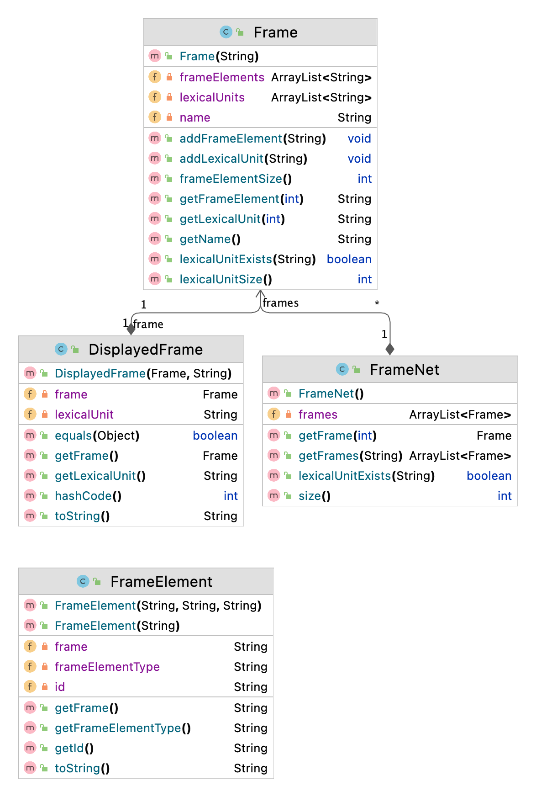

Turkish FrameNet
============

Introduced in 1997, FrameNet (Lowe, 1997; Baker et al., 1998; Fillmore and Atkins, 1998; Johnson et al., 2001) has been developed by the International Computer Science Institute in Berkeley, California. It is a growing computational lexicography project that offers in-depth semantic information on English words and 
predicates. Based on the theory of Frame Semantics by Fillmore (Fillmore and others, 1976; Fillmore, 2006), FrameNet offers semantic information on predicate-argument structure in a way that is loosely similar to wordnet (Kilgarriff and Fellbaum, 2000).

In FrameNet, predicates and related lemmas are categorized under frames. The notion of frame here is thoroughly described in Frame Semantics as a schematic representation of an event, state or relationship. These semantic information packets called frames are constituted of individual lemmas (also known as Lexical Units) and frame elements (such as the agent, theme, instrument, duration, manner, direction etc.). Frame elements can be described as semantic roles that are related to the frame. Lexical Units, or lemmas, are linked to a frame through a single sense. For instance, the lemma ”roast” can mean to criticise harshly
or to cook by exposing to dry heat. With its latter meaning, ”roast” belongs to the Apply Heat frame.

In this version of Turkish FrameNet, we aimed to release a version of Turkish FrameNet that captures at least a considerable majority of the most frequent predicates, thus offering a valuable and practical resource from day one. Because Turkish is a low-resource language, it was important to ensure that FrameNet had enough coverage that it could be incorporated into NLP solutions as soon as it is released to the public.

We took a closer look at Turkish WordNet and designated 8 domains that would possibly contain the most frequent predicates in Turkish: Activity, Cause, Change, Motion, Cognition, Perception, Judgement and Commerce. For the first phase, the focus was on the thorough annotation of these domains. Frames from
English FrameNet were adopted when possible and new frames were created when needed. In the next phase, team of annotators will attack the
Turkish predicate compilation offered by TRopBank and KeNet for a lemma-by-lemma annotation process. This way, both penetration and coverage of the Turkish FrameNet will be increased.

Video Lectures
============

[](https://youtu.be/mE600WMdSrQ)

For Developers
============

You can also see [Python](https://github.com/starlangsoftware/TurkishFrameNet-Py), [Cython](https://github.com/starlangsoftware/TurkishFrameNet-Cy), [C++](https://github.com/starlangsoftware/TurkishFrameNet-CPP), [C](https://github.com/starlangsoftware/TurkishFrameNet-C), [C#](https://github.com/starlangsoftware/TurkishFrameNet-CS), [Js](https://github.com/starlangsoftware/TurkishFrameNet-Js), [Php](https://github.com/starlangsoftware/TurkishFrameNet-Php), or [Swift](https://github.com/starlangsoftware/TurkishFrameNet-Swift) repository.

## Requirements

* [Java Development Kit 8 or higher](#java), Open JDK or Oracle JDK
* [Maven](#maven)
* [Git](#git)

### Java 

To check if you have a compatible version of Java installed, use the following command:

    java -version
    
If you don't have a compatible version, you can download either [Oracle JDK](https://www.oracle.com/technetwork/java/javase/downloads/jdk8-downloads-2133151.html) or [OpenJDK](https://openjdk.java.net/install/)    

### Maven
To check if you have Maven installed, use the following command:

    mvn --version
    
To install Maven, you can follow the instructions [here](https://maven.apache.org/install.html).      

### Git

Install the [latest version of Git](https://git-scm.com/book/en/v2/Getting-Started-Installing-Git).

## Download Code

In order to work on code, create a fork from GitHub page. 
Use Git for cloning the code to your local or below line for Ubuntu:

	git clone <your-fork-git-link>

A directory called TurkishFrameNet will be created. Or you can use below link for exploring the code:

	git clone https://github.com/olcaytaner/TurkishFrameNet.git

## Open project with IntelliJ IDEA

Steps for opening the cloned project:

* Start IDE
* Select **File | Open** from main menu
* Choose `TurkishFrameNet/pom.xml` file
* Select open as project option
* Couple of seconds, dependencies with Maven will be downloaded. 


## Compile

**From IDE**

After being done with the downloading and Maven indexing, select **Build Project** option from **Build** menu. After compilation process, user can run TurkishFrameNet.

**From Console**

Go to `FrameNet` directory and compile with 

     mvn compile 

## Generating jar files

**From IDE**

Use `package` of 'Lifecycle' from maven window on the right and from `FrameNet` root module.

**From Console**

Use below line to generate jar file:

     mvn install

## Maven Usage

        <dependency>
            <groupId>io.github.starlangsoftware</groupId>
            <artifactId>FrameNet</artifactId>
            <version>1.0.8</version>
        </dependency>

Detailed Description
============

+ [FrameNet](#framenet)
+ [Frame](#frame)

## FrameNet

FrameNet'i okumak ve tüm Frameleri hafızada tutmak için

	a = new FrameNet();

Frameleri tek tek gezmek için

	for (int i = 0; i < a.size(); i++){
		Frame frame = a.getFrame(i);
	}

Bir fiile ait olan Frameleri bulmak için

	frames = a.getFrames("TUR10-1234560")

## Frame

Bir framein lexical unitlerini getirmek için

	String getLexicalUnit(int index)
		
Bir framein frame elementlerini getirmek için

	String getFrameElement(int index)

# Cite

	@inproceedings{marsan20,
 	title = {{B}uilding the {T}urkish {F}rame{N}et},
 	year = {2021},
 	author = {B. Marsan and N. Kara and M. Ozcelik and B. N. Arican and N. Cesur and A. Kuzgun and E. Saniyar and O. Kuyrukcu and O. T. Y{\i}ld{\i}z},
 	booktitle = {Proceedings of GWC 2021}
	}

For Contibutors
============

### Class diagram



### pom.xml file
1. Standard setup for packaging is similar to:
```
    <groupId>io.github.starlangsoftware</groupId>
    <artifactId>Amr</artifactId>
    <version>1.0.0</version>
    <packaging>jar</packaging>
    <name>NlpToolkit.Amr</name>
    <description>Abstract Meaning Representation Library</description>
    <url>https://github.com/StarlangSoftware/Amr</url>

    <organization>
        <name>io.github.starlangsoftware</name>
        <url>https://github.com/starlangsoftware</url>
    </organization>

    <licenses>
        <license>
            <name>The Apache Software License, Version 2.0</name>
            <url>http://www.apache.org/licenses/LICENSE-2.0.txt</url>
        </license>
    </licenses>

    <developers>
        <developer>
            <name>Olcay Taner Yildiz</name>
            <email>olcay.yildiz@ozyegin.edu.tr</email>
            <organization>Starlang Software</organization>
            <organizationUrl>http://www.starlangyazilim.com</organizationUrl>
        </developer>
    </developers>

    <scm>
        <connection>scm:git:git://github.com/starlangsoftware/amr.git</connection>
        <developerConnection>scm:git:ssh://github.com:starlangsoftware/amr.git</developerConnection>
        <url>http://github.com/starlangsoftware/amr/tree/master</url>
    </scm>

    <properties>
        <maven.compiler.source>1.8</maven.compiler.source>
        <maven.compiler.target>1.8</maven.compiler.target>
        <project.build.sourceEncoding>UTF-8</project.build.sourceEncoding>
    </properties>
```
2. Only top level dependencies should be added. Do not forget junit dependency.
```
    <dependencies>
        <dependency>
            <groupId>io.github.starlangsoftware</groupId>
            <artifactId>AnnotatedSentence</artifactId>
            <version>1.0.78</version>
        </dependency>
        <dependency>
            <groupId>junit</groupId>
            <artifactId>junit</artifactId>
            <version>4.13.1</version>
            <scope>test</scope>
        </dependency>
    </dependencies>
```
3. Maven compiler, gpg, source, javadoc plugings should be added.
```
	<plugin>
		<groupId>org.apache.maven.plugins</groupId>
		<artifactId>maven-compiler-plugin</artifactId>
		<version>3.6.1</version>
		<configuration>
			<source>1.8</source>
			<target>1.8</target>
		</configuration>
	</plugin>
	<plugin>
		<groupId>org.apache.maven.plugins</groupId>
		<artifactId>maven-gpg-plugin</artifactId>
		<version>1.6</version>
		<executions>
			<execution>
				<id>sign-artifacts</id>
				<phase>verify</phase>
				<goals>
					<goal>sign</goal>
				</goals>
			</execution>
		</executions>
	</plugin>
	<plugin>
		<groupId>org.apache.maven.plugins</groupId>
		<artifactId>maven-source-plugin</artifactId>
		<version>2.2.1</version>
		<executions>
			<execution>
				<id>attach-sources</id>
				<goals>
					<goal>jar-no-fork</goal>
				</goals>
			</execution>
		</executions>
	</plugin>
	<plugin>
		<groupId>org.apache.maven.plugins</groupId>
		<artifactId>maven-javadoc-plugin</artifactId>
		<configuration>
			<source>8</source>
		</configuration>
		<version>3.10.0</version>
		<executions>
			<execution>
				<id>attach-javadocs</id>
				<goals>
					<goal>jar</goal>
				</goals>
			</execution>
		</executions>
	</plugin>
```
4. Currently publishing plugin is Sonatype.
```
	<plugin>
		<groupId>org.sonatype.central</groupId>
		<artifactId>central-publishing-maven-plugin</artifactId>
		<version>0.8.0</version>
		<extensions>true</extensions>
		<configuration>
			<publishingServerId>central</publishingServerId>
			<autoPublish>true</autoPublish>
		</configuration>
	</plugin>
```
5. For UI jar files use assembly plugins.
```
	<plugin>
		<groupId>org.apache.maven.plugins</groupId>
		<artifactId>maven-assembly-plugin</artifactId>
		<version>2.2-beta-5</version>
		<executions>
			<execution>
				<id>sentence-dependency</id>
				<phase>package</phase>
				<goals>
					<goal>single</goal>
				</goals>
				<configuration>
					<archive>
						<manifest>
							<mainClass>Amr.Annotation.TestAmrFrame</mainClass>
						</manifest>
					</archive>
					<finalName>amr</finalName>
				</configuration>
			</execution>
		</executions>
		<configuration>
			<descriptorRefs>
				<descriptorRef>jar-with-dependencies</descriptorRef>
			</descriptorRefs>
			<appendAssemblyId>false</appendAssemblyId>
		</configuration>
	</plugin>
```
### Resources
1. Add resources to the resources subdirectory. These will include image files (necessary for UI), data files, etc.
   
### Java files
1. Do not forget to comment each function.
```
    /**
     * Returns the value of a given layer.
     * @param viewLayerType Layer for which the value questioned.
     * @return The value of the given layer.
     */
    public String getLayerInfo(ViewLayerType viewLayerType){
```
2. Function names should follow caml case.
```
    public MorphologicalParse getParse()
```
3. Write toString methods, if necessary.
4. Use Junit for writing test classes. Use test setup if necessary.
```
public class AnnotatedSentenceTest {
    AnnotatedSentence sentence0, sentence1, sentence2, sentence3, sentence4;
    AnnotatedSentence sentence5, sentence6, sentence7, sentence8, sentence9;

    @Before
    public void setUp() throws Exception {
        sentence0 = new AnnotatedSentence(new File("sentences/0000.dev"));
```
